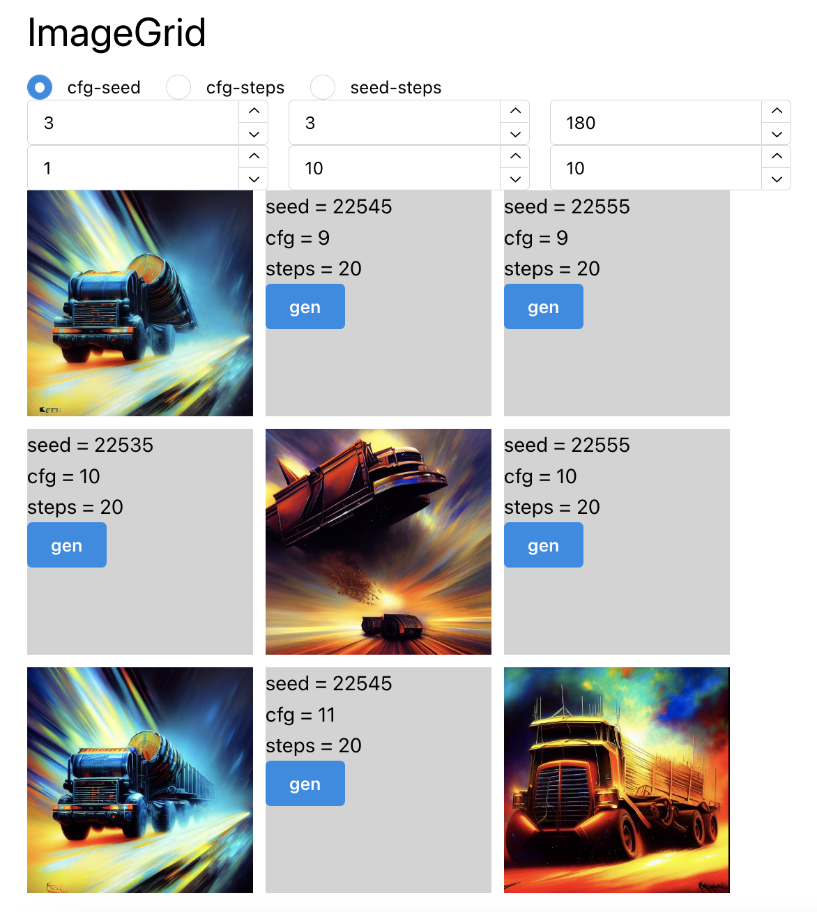

# SdPlayground

This is a tool / front end to connect to the Stable Diffusion API. The goal is to navigate various prompt and image setting quickly. Further the hope is that useful images are not lost in the exploration process.

This is a very rough work in progress still.

## General usage

The goal is to allow the user to vary a given part of the prompt through a range of values. The display is likely to be a table showing specific instances of each value.

Current support is for the `cfg`, `steps`, and `seed` parameters. The end goal is to add support for altering prompts in various ways too.

## Screenshots

### Showing the prompt input and already generated groups

### Showing the grid display for a single group

- Clicking a group in the above image will load a group
- Clicking any of the blue `gen` buttons will request the image to be created via SD.

### Showing a table of results

### Table of results varying the artist

### Table of varying the prompt from more to less complex

### Controls for grid display

## Technology

Rough notes:

- Using Nx to coordinate front end, back end, and shared types
- Backend = express server
  - Stable Diffusion is called via the Dream Studio API. I am using the python package `stability-sdk` package to do the heavy lifting.
  - This will deploy to some box.
  - This backend stores generated images on disk.
  - There is a `sqlite` database to track the generated images and communicate to the front end.
- Front end = Next.js set up
  - End goal will deploy to Vercel.
  - Using `mantine` for the UI components -- normally I use BlueprintJS... trying something new
- Shared types related to the `SdImage` and related types
